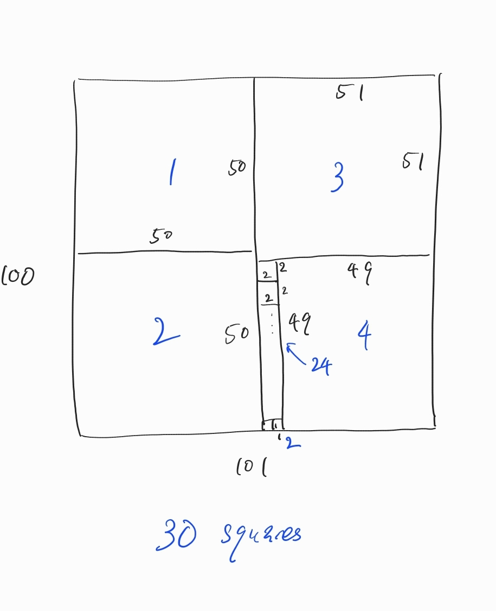

# CS240 Spring 2024 exams
The solution in the files may not be correct.


## Midterm

 72.0 / 100.0 

- Question 1: 20 / 25 pts

  (c) Wrong

```
Consider a problem A that always return True, A should be in NP. But we can't reduce a NPC problem into A. 
```

- Question 2: 15 / 15 pts

- Question 3: 15 / 15 pts

- Question 4: 2 / 15 pts

  ```
  If I modify my algorithm to let j=i−1,i the algorithm would be the correct one.
  ```

- Question 5: 15 / 15 pts

- Question 6: 5 / 15 pts

  ```
  Here's an example for problem 6 where greedy would use 101 squares, and there's a solution with <= 30 squares
  ```

  

```
The correct solution should use a Interval dp.
```


## Final

 94.0 / 100.0 

- Question 1: 25 / 25 pts
- Question 2: 15 / 15 pts

- Question 3: 15 / 15 pts

- Question 4: 9 / 15 pts

  ```
  -3 pts: Dynamic programming equation partially not correct
  -3 pts: Time complexity analysis not correct
  ```

- Question 5: 15 / 15 pts

- Question 6: 15 / 15 pts